<div align="center">


</div>

## Indice

- [Specifiche del progetto](#specifiche)
- [Fase di progettazione](#progettazione)
- [Rotte](#rotte)
- [Implementazione](#implementazione)
- [Test](#testing)
- [Autori](#autori)

## Specifiche del progetto
#### Consegna:
Le specifiche del progetto sono state fornite dal professore [*Adriano Mancini*](https://github.com/manciniadriano):

*Si realizzi un sistema che consenta di gestire il calcolo della multa a seguito del passaggio di autoveicoli con classi differenti in un varco ZTL. Una città può avere diversi varchi ZTL. Dovranno essere modellati le tipologie di veicolo che hanno poi costi differenti. Dovranno essere inoltre modellati i varchi in modo da avere ZTL aperte / chiuse in alcune ore del giorno e della settimana. Dovranno essere inseribili i transiti impostando data e ora del passaggio e targa del veicolo lungo un varco specifico. Un veicolo in un giorno può attraversare diversi varchi ZTL. Il sistema deve anche provvedere a calcolare il costo dell’infrazione (si lascia discrezione al gruppo per la gestione delle tariffe che devono comunque prevedere una differenziazione per tipologia del veicolo, fascia oraria e giorno della settimana es. festivo / feriale). Si deve prevedere anche una white list che consente di non multare i veicoli.*

*Si predispongano i seguenti ruoli:*
- *Operatore*
- *Varco*
- *Automobilista*

- *Devono essere predisposte le seguenti rotte:*
  - *CRUD per la gestione delle ZTL (utente operatore)*
  - *CRUD per la gestione delle dei varchi (utente operatore)*
  - *CRUD per inserimento transiti (ingresso o uscita):*
    - *POST (inserimento) operatore OR varco*
    - *GET (ottenere specifico varco) solo operatore*
    - *DELETE e UPDATE solo operatore*
- *Creare una rotta che data/e una o più targhe in ingresso ed un periodo temporale fornisca lo stato dei transiti con i dettagli del caso (varco in, tipologia veicolo, multa).  L’utente può specificare il formato in uscita che è: JSON, PDF (tutti e due i formati devono essere implementati). Utente operatore non ha limiti mentre automobilista può vedere solo i veicoli ad esso associati*
- *Creare una rotta fruibile dall’operatore che fornisca delle statistiche per varco (operatore può filtrare per range temporale); l’utente può scegliere il formato in uscita se JSON o PDF:*
  - *Numero di violazioni totali*
  - *Numero di violazioni totali rispetto ai transiti totali*
  - *Importo delle multe*

- *Creare una rotta che consenta all’automobilista di verificare se ci sono multe a suo carico (logica a carico del gruppo su come fare).*

- *Creare una rotta che consenta di scaricare un bollettino di pagamento in formato PDF che contenga targa, importo ed un QR-code che riporti la stringa <multa id>|<targa>|<importo>.*

*Si chiede di sviluppare il codice utilizzando TypeScript. Ogni utente autenticato (ovvero con JWT) ha un numero di token (valore iniziale impostato nel seed del database).*

*Le richieste devono essere validate*

*I dati di cui sopra devono essere memorizzati in un database esterno interfacciato con Sequelize. La scelta del DB è a discrezione degli studenti.*

*Si chiede di utilizzare le funzionalità di middleware.*

*Si chiede di gestire eventuali errori mediante gli strati middleware sollevando le opportune eccezioni.*

*Si chiede di commentare opportunamente il codice.*

## Configurazione

### Diagrammi UML


## API Routes

| **Metodo** | **Rotta**                          | **Parametri**                                                                                  | **Descrizione**                                                                                          |
|------------|------------------------------------|------------------------------------------------------------------------------------------------|----------------------------------------------------------------------------------------------------------|
| **Ztl**    |                                    |                                                                                                |                                                                                                          |
| `GET`      | `/api/ztl`                         | Nessuno                                                                                        | Ottiene tutte le ZTL.                                                                                    |
| `GET`      | `/api/ztl/{id}`                    | `id` (ID della ZTL)                                                                            | Ottiene una ZTL specifica tramite l'ID fornito.                                                          |
| `POST`     | `/api/ztl`                         | `nome`, `is_active`                                                                            | Crea una nuova ZTL con i dati forniti.                                                                   |
| `PUT`      | `/api/ztl/{id}`                    | `nome`, `is_active`                                                                            | Aggiorna una ZTL esistente con i dati forniti.                                                           |
| `DELETE`   | `/api/ztl/{id}`                    | `id` (ID della ZTL)                                                                            | Elimina una ZTL specifica tramite l'ID fornito.                                                          |
| **User**   |                                    |                                                                                                |                                                                                                          |
| `GET`      | `/api/user/all`                    | `Authorization` (header)                                                                       | Ottiene tutti gli utenti.                                                                                |
| `GET`      | `/api/user/tokens`                 | `Authorization` (header)                                                                       | Ottiene i token di un utente.                                                                            |
| `POST`     | `/api/register`                    | `nome`, `email`, `password`, `ruolo`                                                           | Registra un nuovo utente.                                                                                |
| `POST`     | `/api/login`                       | `email`, `password`                                                                            | Effettua il login.                                                                                       |
| **Varchi** |                                    |                                                                                                |                                                                                                          |
| `GET`      | `/api/varchi`                      | `Authorization` (header)                                                                       | Ottiene tutti i varchi.                                                                                  |
| `GET`      | `/api/varchi/{id}`                 | `Authorization` (header)                                                                       | Ottiene un varco specifico tramite l'ID fornito.                                                         |
| `POST`     | `/api/varchi`                      | `nome`, `ztl_id`, `orario_apertura`, `orario_chiusura`                                         | Crea un nuovo varco con i dati forniti.                                                                  |
| `PUT`      | `/api/varchi/{id}`                 | `nome`, `ztl_id`, `orario_apertura`, `orario_chiusura`                                         | Aggiorna un varco esistente con i dati forniti.                                                          |
| `DELETE`   | `/api/varchi/{id}`                 | `Authorization` (header)                                                                       | Elimina un varco specifico tramite l'ID fornito.                                                         |
| **Multe**  |                                    |                                                                                                |                                                                                                          |
| `GET`      | `/api/multe`                       | `Authorization` (header)                                                                       | Ottiene tutte le multe.                                                                                  |
| `GET`      | `/api/multe/{id}`                  | `Authorization` (header)                                                                       | Ottiene una multa specifica tramite l'ID fornito.                                                        |
| `GET`      | `/api/multeautomobilista`          | `Authorization` (header)                                                                       | Ottiene tutte le multe dell'automobilista.                                                               |
| `GET`      | `/api/multe/{id}/download`         | `Authorization` (header)                                                                       | Ottiene il PDF di una multa specifica tramite l'ID fornito.                                              |
| `POST`     | `/api/multe`                       | `transito_id`, `importo`, `data_emissione`, `targa_veicolo`, `is_pagata`                       | Crea una nuova multa con i dati forniti.                                                                 |
| `PUT`      | `/api/multe/{id}`                  | `transito_id`, `importo`, `data_emissione`, `targa_veicolo`, `is_pagata`                       | Aggiorna una multa esistente con i dati forniti.                                                         |
| `DELETE`   | `/api/multe/{id}`                  | `Authorization` (header)                                                                       | Elimina una multa specifica tramite l'ID fornito.                                                        |
| **Transiti**|                                   |                                                                                                |                                                                                                          |
| `GET`      | `/api/transiti`                    | `Authorization` (header)                                                                       | Ottiene tutti i transiti.                                                                                |
| `GET`      | `/api/transiti/{id}`               | `Authorization` (header)                                                                       | Ottiene un transito specifico tramite l'ID fornito.                                                      |
| `GET`      | `/api/transitistato`               | `targhe`, `startDate`, `endDate`, `format`                                                     | Ottiene lo stato dei transiti per le targhe specificate.                                                 |
| `POST`     | `/api/transiti`                    | `targa_veicolo`, `pedaggio`, `varco_id`, `ingresso_uscita`                                     | Crea un nuovo transito con i dati forniti.                                                               |
| `PUT`      | `/api/transiti/{id}`               | `targa_veicolo`, `pedaggio`, `varco_id`, `ingresso_uscita`                                     | Aggiorna un transito esistente con i dati forniti.                                                       |
| `DELETE`   | `/api/transiti/{id}`               | `Authorization` (header)                                                                       | Elimina un transito specifico tramite l'ID fornito.                                                      |
| **Veicoli**|                                    |                                                                                                |                                                                                                          |
| `GET`      | `/api/veicoli`                     | `Authorization` (header)                                                                       | Ottiene tutti i veicoli.                                                                                 |
| `GET`      | `/api/veicoli/{targa}`             | `Authorization` (header)                                                                       | Ottiene un veicolo specifico tramite la targa fornita.                                                   |
| `POST`     | `/api/veicoli`                     | `targa`, `tipo`, `proprietario_id`                                                             | Crea un nuovo veicolo con i dati forniti.                                                                |
| `DELETE`   | `/api/veicoli/{targa}`             | `Authorization` (header)                                                                       | Elimina un veicolo specifico tramite la targa fornita.                                                   |
| **Whitelist**|                                  |                                                                                                |                                                                                                          |
| `GET`      | `/api/whitelist`                   | `Authorization` (header)                                                                       | Ottiene tutti i veicoli in whitelist.                                                                    |
| `GET`      | `/api/whitelist/{targa}`           | `Authorization` (header)                                                                       | Ottiene un veicolo in whitelist tramite la targa fornita.                                                |
| `POST`     | `/api/whitelist`                   | `targa_veicolo`, `inizio_validita`, `fine_validita`                                            | Aggiunge un veicolo alla whitelist con i dati forniti.                                                   |
| `PUT`      | `/api/whitelist/{id}`              | `targa_veicolo`, `inizio_validita`, `fine_validita`                                            | Aggiorna un veicolo in whitelist esistente con i dati forniti.                                           |
| `DELETE`   | `/api/whitelist/{id}`              | `Authorization` (header)                                                                       | Rimuove un veicolo dalla whitelist tramite l'ID fornito.                                                 |
| **Statistiche**|                                |                                                                                                |                                                                                                          |
| `GET`      | `/api/statistiche`                 | `start_date`, `end_date`, `format`, `varco_id`                                                 | Ottiene statistiche basate sui parametri specificati.                                                    |


### Pattern

#### MVC (Model-View-Controller)
Il pattern MVC è un paradigma di progettazione software che separa l'applicazione in tre componenti principali: Modello (gestisce i dati e le regole del business), Vista (presenta i dati all'utente), e Controller (interpreta i comandi dell'utente, facendo da ponte tra Modello e Vista). Nel nostro progetto, abbiamo adottato un approccio M(V)C, dove la Vista non è direttamente implementata considerando la natura del backend, focalizzandoci su Modello e Controller per gestire dati e logica applicativa.

#### Singleton Pattern
Nel nostro progetto, oltre all'utilizzo del pattern MVC, abbiamo implementato il pattern Singleton per gestire la connessione al database. Il pattern Singleton garantisce che una classe abbia una sola istanza e fornisce un punto globale di accesso a questa istanza. Questo è particolarmente utile per la connessione al database, in quanto evita di creare connessioni multiple non necessarie e permette di gestire in modo efficiente le risorse.

Nel nostro caso, la classe DbConnector utilizza il pattern Singleton per garantire una sola istanza della connessione al database. Ecco come funziona:

```javascript
import { Sequelize } from 'sequelize';
import dotenv from 'dotenv';

dotenv.config();

const dbUsername = process.env.PGUSER || 'postgres';
const dbPassword = process.env.PGPASSWORD;
const dbName = process.env.PGDATABASEE || 'mydb';
const dbHost = process.env.PGHOST || 'db';

export class DbConnector {
    private static instance: DbConnector;
    private sequelizer: any;

    private constructor() {
        this.sequelizer = new Sequelize(dbName, dbUsername, dbPassword, {
            host: dbHost,
            dialect: 'postgres',
        });
    }

    public static getConnection(): any {
        if (!DbConnector.instance) {
            this.instance = new DbConnector();
        }
        return DbConnector.instance.sequelizer;
    }
}
```

In questo file, la classe DbConnector ha un costruttore privato che inizializza una nuova connessione al database utilizzando Sequelize. Il metodo statico getConnection verifica se esiste già un'istanza di DbConnector; se non esiste, crea una nuova istanza. In questo modo, tutte le parti dell'applicazione che necessitano di accedere al database utilizzano la stessa connessione condivisa, migliorando l'efficienza e la gestione delle risorse.

#### Facade Pattern

Nel nostro progetto abbiamo utilizzato anche il pattern Facade, che fornisce un'interfaccia semplificata per un insieme complesso di classi, librerie o API. Questo pattern è utile per nascondere la complessità del sistema e fornire una interfaccia più semplice e accessibile.

Nel contesto del nostro progetto, il pattern Facade viene implementato attraverso l'uso della classe MessageGenerator che centralizza e semplifica la gestione delle risposte HTTP e dei messaggi di stato. Invece di dover scrivere ripetutamente codice per gestire le risposte e i messaggi di errore, utilizziamo il MessageGenerator per fornire una interfaccia unica e coerente.

Ecco un esempio di come il MessageGenerator viene utilizzato nei nostri controller:

```javascript
export const createZtl = async (req: Request, res: Response) => {
    try {
        const { nome, is_active } = req.body;

        const ztl = await Ztl.create(req.body);

        return MessageGenerator.getStatusMessage(StatusCodes.CREATED, res, Messages201.ZTLCreationSuccess);
    } catch (error) {
        return MessageGenerator.getStatusMessage(StatusCodes.INTERNAL_SERVER_ERROR, res, Messages500.InternalServerError);
    }
};
```

## Implementazione
 
Nella seguente sezione descriveremo in dettaglio ciascuna rotta creata. Ogni chiamata API sarà spiegata con i parametri richiesti e accompagnata da un diagramma delle sequenze che mostrerà l'interazione tra i diversi componenti del sistema. Questo metodo permetterà di comprendere il flusso di dati e la logica dietro le operazioni disponibili tramite l'API, includendo anche informazioni sui risultati restituiti da ciascuna rotta. Inoltre, saranno indicati alcuni tipi di errori che possono verificarsi in caso di problemi con i dati inviati nel body della richiesta.


### POST: /login

#### Descrizione:
Permette a un utente di effettuare il login e ottenere un token JWT.

#### Input

{
    "email": "mario.rossi@example.com",
    "password": "Password123!"
}

#### Diagramma di Sequenza

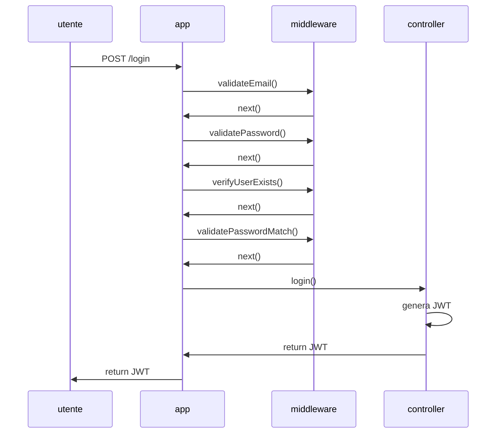
```mermaid

sequenceDiagram
    participant utente
    participant app
    participant middleware
    participant controller

    utente->>app: POST /login
    app->>middleware: validateEmail()
    middleware->>app: next()
    app->>middleware: validatePassword()
    middleware->>app: next()
    app->>middleware: verifyUserExists()
    middleware->>app: next()
    app->>middleware: validatePasswordMatch()
    middleware->>app: next()
    app->>controller: login()
    controller->>controller: genera JWT
    controller->>app: return JWT
    app->>utente: return JWT

```

#### Output (Successo)

```json

{
    "jwt": "eyJhbGciOiJIUzI1NiIsInR5cCI6IkpXVCJ9..."
}
```
#### Output (Errore)

```json

{
    "status": 400,
    "message": "Email o password non validi"
}
```

### POST: /register
#### Descrizione
Permette di registrare un nuovo utente.

#### Input
```json
{
    "nome": "Mario Rossi",
    "email": "mario.rossi@example.com",
    "password": "Password123!",
    "ruolo": "operatore"
}
```

#### Diagramma di Sequenza

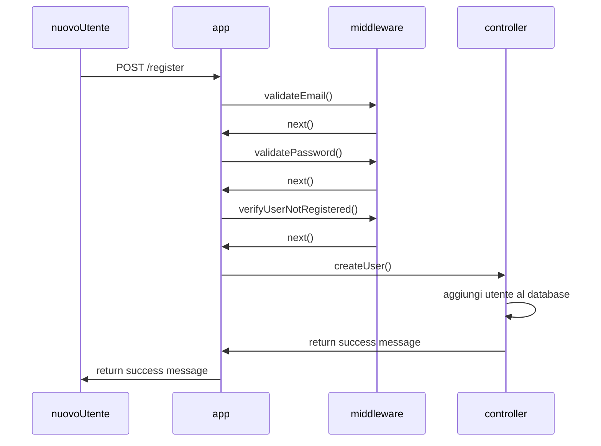
```mermaid

sequenceDiagram
    participant nuovoUtente
    participant app
    participant middleware
    participant controller

    nuovoUtente->>app: POST /register
    app->>middleware: validateEmail()
    middleware->>app: next()
    app->>middleware: validatePassword()
    middleware->>app: next()
    app->>middleware: verifyUserNotRegistered()
    middleware->>app: next()
    app->>controller: createUser()
    controller->>controller: aggiungi utente al database
    controller->>app: return success message
    app->>nuovoUtente: return success message
```
#### Output (Successo)

```json

{
    "status": 201,
    "message": "Utente creato con successo"
}
``` 

#### Output (Errore)

```json

{
    "status": 400,
    "message": "Email già registrata"
}
```

### GET: /user/tokens
#### Descrizione

Ottiene il numero di token di un utente autenticato tramite JWT.

#### Diagramma di Sequenza

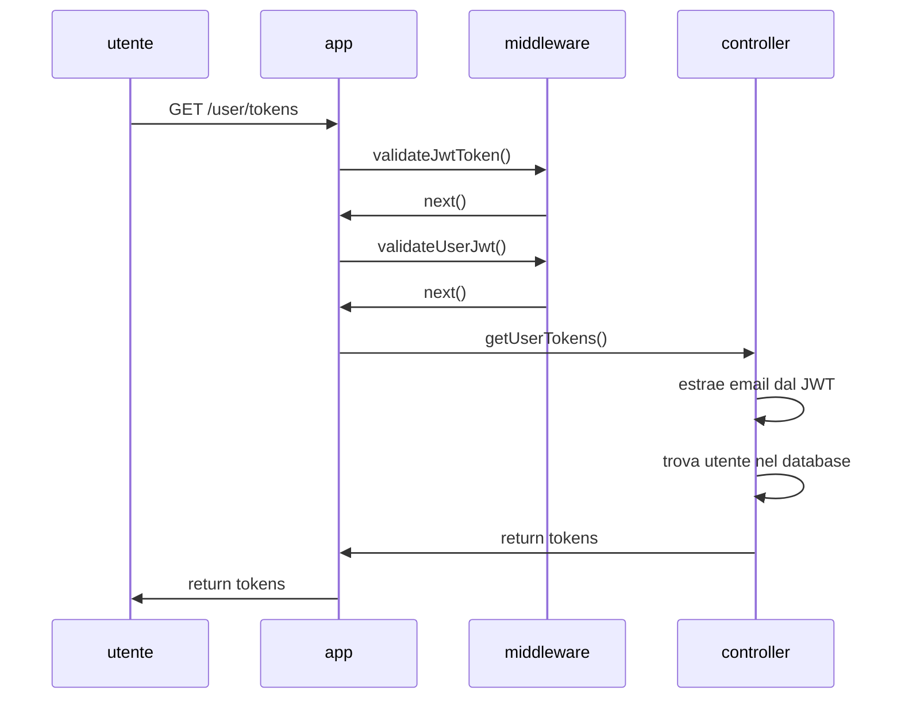
```mermaid

sequenceDiagram
    participant utente
    participant app
    participant middleware
    participant controller

    utente->>app: GET /user/tokens
    app->>middleware: validateJwtToken()
    middleware->>app: next()
    app->>middleware: validateUserJwt()
    middleware->>app: next()
    app->>controller: getUserTokens()
    controller->>controller: estrae email dal JWT
    controller->>controller: trova utente nel database
    controller->>app: return tokens
    app->>utente: return tokens
```

#### Output (Successo)

```json

{
    "tokens": 100.0
}
```

#### Output (Errore)

```json

{
    "status": 500,
    "message": "Errore interno del server"
}
```

### GET: /user/all
#### Descrizione

Ottiene tutti gli utenti (accessibile solo con JWT e ruolo di operatore).

#### Diagramma di Sequenza

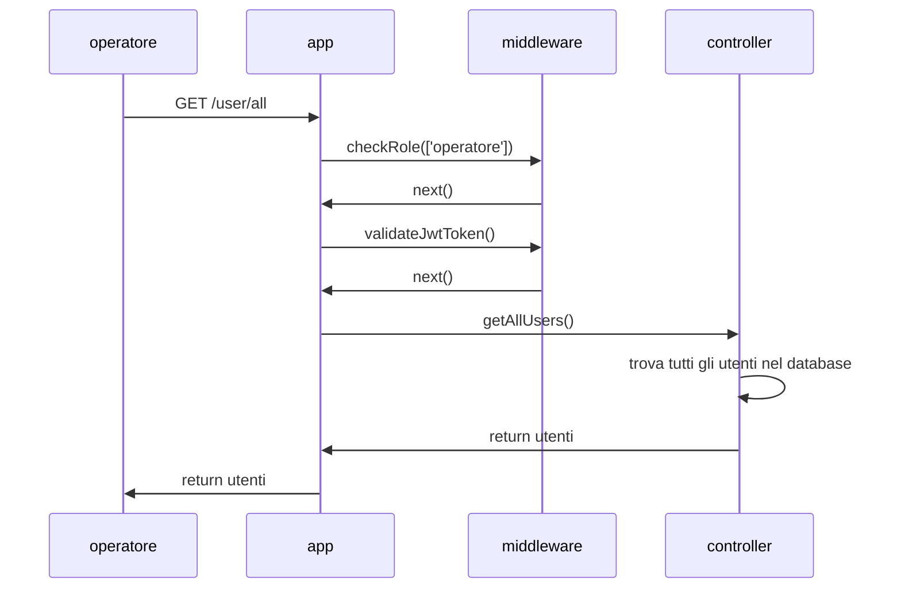
```mermaid

sequenceDiagram
    participant operatore
    participant app
    participant middleware
    participant controller

    operatore->>app: GET /user/all
    app->>middleware: checkRole(['operatore'])
    middleware->>app: next()
    app->>middleware: validateJwtToken()
    middleware->>app: next()
    app->>controller: getAllUsers()
    controller->>controller: trova tutti gli utenti nel database
    controller->>app: return utenti
    app->>operatore: return utenti
```

#### Output (Successo)

```json

{
    "users": [
        {
            "id": 1,
            "nome": "Mario Rossi",
            "email": "mario.rossi@example.com",
            "tokens": 100.0,
            "ruolo": "operatore"
        },
        ...
    ]
}
```

#### Output (Errore)

```json

{
    "status": 500,
    "message": "Errore interno del server"
}
```


### GET: /ztl
#### Descrizione

Ottiene tutte le ZTL.

#### Input

N/A

#### Diagramma di Sequenza

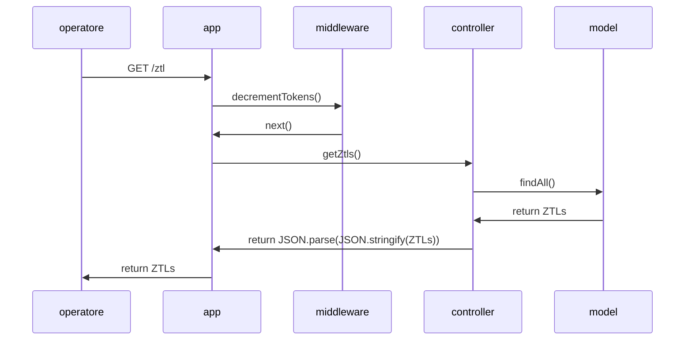
```mermaid

sequenceDiagram
    participant operatore
    participant app
    participant middleware
    participant controller
    participant model

    operatore->>app: GET /ztl
    app->>middleware: decrementTokens()
    middleware->>app: next()
    app->>controller: getZtls()
    controller->>model: findAll()
    model->>controller: return ZTLs
    controller->>app: return JSON.parse(JSON.stringify(ZTLs))
    app->>operatore: return ZTLs
```

#### Output (Successo)

```json

[
    {
        "id": 1,
        "nome": "ZTL Centro",
        "is_active": true
    },
    ...
]
```

#### Output (Errore)

```json

{
    "status": 500 INTERNAL SERVER ERROR,
    "message": "Errore interno del server"
}
```

### POST: /ztl

#### Descrizione

Crea una nuova ZTL.

#### Input

```json

{
    "nome": "ZTL Centro",
    "is_active": true
}
```

#### Diagramma di Sequenza

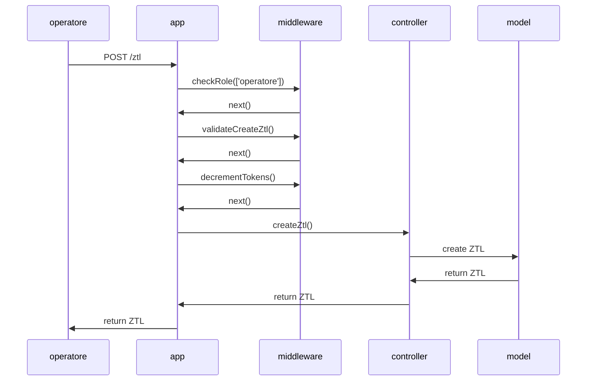
```mermaid

sequenceDiagram
    participant operatore
    participant app
    participant middleware
    participant controller
    participant model

    operatore->>app: POST /ztl
    app->>middleware: checkRole(['operatore'])
    middleware->>app: next()
    app->>middleware: validateCreateZtl()
    middleware->>app: next()
    app->>middleware: decrementTokens()
    middleware->>app: next()
    app->>controller: createZtl()
    controller->>model: create ZTL
    model->>controller: return ZTL
    controller->>app: return ZTL
    app->>operatore: return ZTL
```

#### Output (Successo)

```json

{
    "id": 1,
    "nome": "ZTL Centro",
    "is_active": true
}
```

#### Output (Errore)

```json

{
    "status": 400 BAD REQUEST,
    "message": "Campi mancanti per ZTL"
}
```

### GET: /ztl/
#### Descrizione

Ottiene una ZTL specifica tramite ID.

#### Input

N/A

#### Diagramma di Sequenza

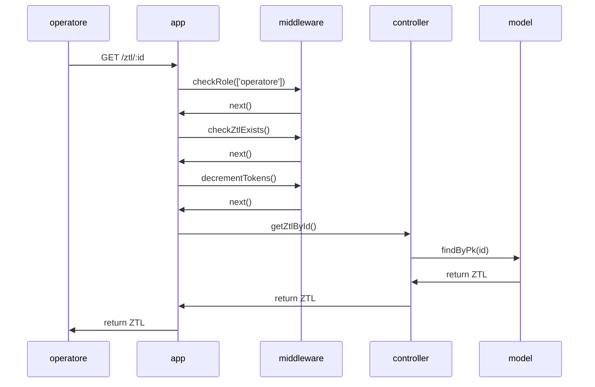
```mermaid

sequenceDiagram
    participant operatore
    participant app
    participant middleware
    participant controller
    participant model

    operatore->>app: GET /ztl/:id
    app->>middleware: checkRole(['operatore'])
    middleware->>app: next()
    app->>middleware: checkZtlExists()
    middleware->>app: next()
    app->>middleware: decrementTokens()
    middleware->>app: next()
    app->>controller: getZtlById()
    controller->>model: findByPk(id)
    model->>controller: return ZTL
    controller->>app: return ZTL
    app->>operatore: return ZTL
```
#### Output (Successo)

```json

{
    "id": 1,
    "nome": "ZTL Centro",
    "is_active": true
}
```

#### Output (Errore)

```json

{
    "status": 404 NOT FOUND,
    "message": "ZTL non trovata"
}
```

### PUT: /ztl/
#### Descrizione

Aggiorna una ZTL specifica tramite ID.

#### Input

```json

{
    "nome": "ZTL Centro Aggiornato",
    "is_active": false
}
```

#### Diagramma di Sequenza

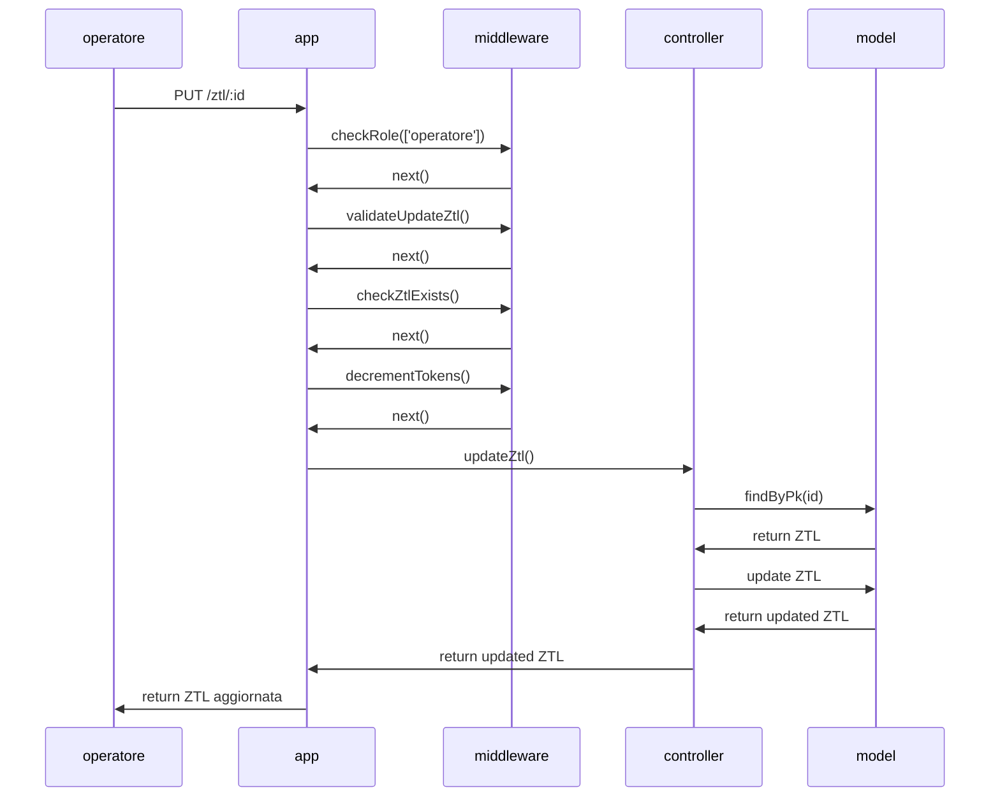
```mermaid

sequenceDiagram
    participant operatore
    participant app
    participant middleware
    participant controller
    participant model

    operatore->>app: PUT /ztl/:id
    app->>middleware: checkRole(['operatore'])
    middleware->>app: next()
    app->>middleware: validateUpdateZtl()
    middleware->>app: next()
    app->>middleware: checkZtlExists()
    middleware->>app: next()
    app->>middleware: decrementTokens()
    middleware->>app: next()
    app->>controller: updateZtl()
    controller->>model: findByPk(id)
    model->>controller: return ZTL
    controller->>model: update ZTL
    model->>controller: return updated ZTL
    controller->>app: return updated ZTL
    app->>operatore: return ZTL aggiornata
```
#### Output (Successo)

```json

{
    "id": 1,
    "nome": "ZTL Centro Aggiornato",
    "is_active": false
}
```

#### Output (Errore)

```json

{
    "status": 400 BAD REQUEST,
    "message": "Campi mancanti per ZTL"
}
```

### DELETE: /ztl/
#### Descrizione

Elimina una ZTL specifica tramite ID.

#### Input

N/A

#### Diagramma di Sequenza

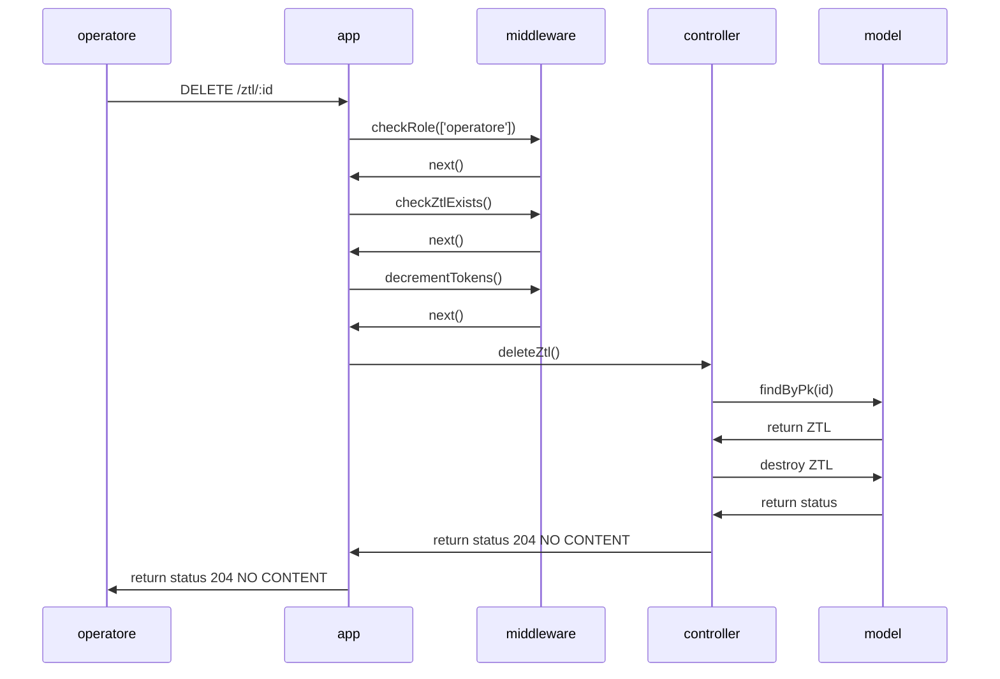
```mermaid

sequenceDiagram
    participant operatore
    participant app
    participant middleware
    participant controller
    participant model

    operatore->>app: DELETE /ztl/:id
    app->>middleware: checkRole(['operatore'])
    middleware->>app: next()
    app->>middleware: checkZtlExists()
    middleware->>app: next()
    app->>middleware: decrementTokens()
    middleware->>app: next()
    app->>controller: deleteZtl()
    controller->>model: findByPk(id)
    model->>controller: return ZTL
    controller->>model: destroy ZTL
    model->>controller: return status
    controller->>app: return status 204 NO CONTENT
    app->>operatore: return status 204 NO CONTENT
```

#### Output (Successo)

```json

{
    "status": 204 NO CONTENT,
    "message": "ZTL eliminata con successo"
}
```

#### Output (Errore)

```json

{
    "status": 404 NOT FOUND,
    "message": "ZTL non trovata"
}
```

### POST: /varchi

#### Descrizione
Crea un nuovo varco.

#### Input
```json
{
    "nome": "Varco 1",
    "ztl_id": 1,
    "orario_apertura": "08:00:00",
    "orario_chiusura": "20:00:00"
}
```

#### Diagramma di Sequenza
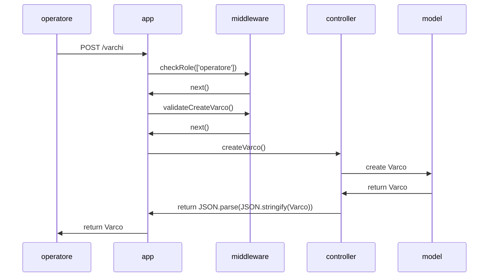
```mermaid
sequenceDiagram
    participant operatore
    participant app
    participant middleware
    participant controller
    participant model

    operatore->>app: POST /varchi
    app->>middleware: checkRole(['operatore'])
    middleware->>app: next()
    app->>middleware: validateCreateVarco()
    middleware->>app: next()
    app->>controller: createVarco()
    controller->>model: create Varco
    model->>controller: return Varco
    controller->>app: return JSON.parse(JSON.stringify(Varco))
    app->>operatore: return Varco
```

#### Output (Successo)
```json
{
    "id": 1,
    "nome": "Varco 1",
    "ztl_id": 1,
    "orario_apertura": "08:00:00",
    "orario_chiusura": "20:00:00"
}
```

#### Output (Errore)
```json
{
    "status": 400 BAD REQUEST,
    "message": "Orario non valido"
}
```

### GET: /varchi

#### Descrizione
Ottiene tutti i varchi.

#### Input
N/A

#### Diagramma di Sequenza
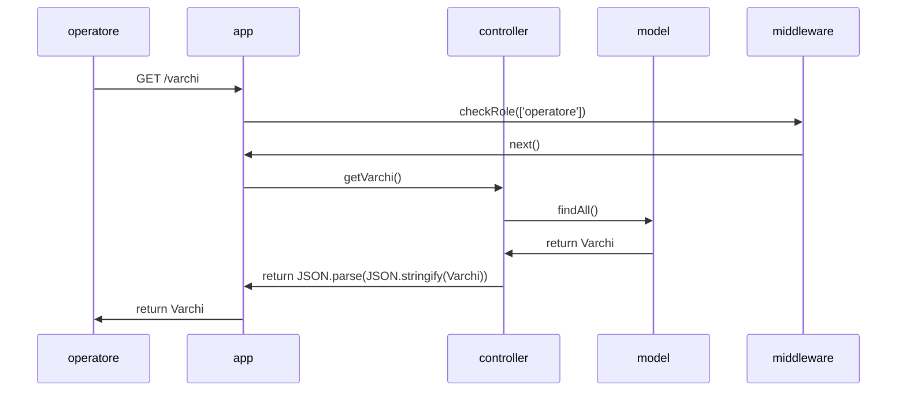
```mermaid
sequenceDiagram
    participant operatore
    participant app
    participant controller
    participant model

    operatore->>app: GET /varchi
    app->>middleware: checkRole(['operatore'])
    middleware->>app: next()
    app->>controller: getVarchi()
    controller->>model: findAll()
    model->>controller: return Varchi
    controller->>app: return JSON.parse(JSON.stringify(Varchi))
    app->>operatore: return Varchi
```

#### Output (Successo)
```json
[
    {
        "id": 1,
        "nome": "Varco 1",
        "ztl_id": 1,
        "orario_apertura": "08:00:00",
        "orario_chiusura": "20:00:00"
    },
    ...
]
```

#### Output (Errore)
```json
{
    "status": 500 INTERNAL SERVER ERROR,
    "message": "Errore interno del server"
}
```

---

### GET: /varchi/:id

#### Descrizione
Ottiene un varco specifico tramite ID.

#### Input
N/A

#### Diagramma di Sequenza
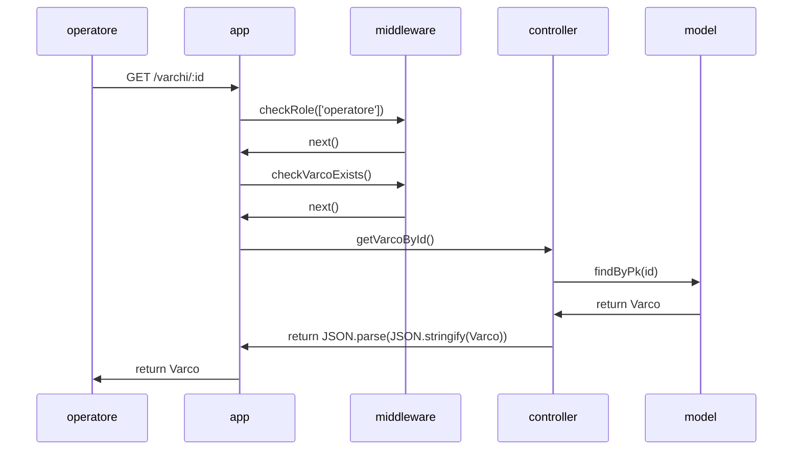
```mermaid
sequenceDiagram
    participant operatore
    participant app
    participant middleware
    participant controller
    participant model

    operatore->>app: GET /varchi/:id
    app->>middleware: checkRole(['operatore'])
    middleware->>app: next()
    app->>middleware: checkVarcoExists()
    middleware->>app: next()
    app->>controller: getVarcoById()
    controller->>model: findByPk(id)
    model->>controller: return Varco
    controller->>app: return JSON.parse(JSON.stringify(Varco))
    app->>operatore: return Varco
```

#### Output (Successo)
```json
{
    "id": 1,
    "nome": "Varco 1",
    "ztl_id": 1,
    "orario_apertura": "08:00:00",
    "orario_chiusura": "20:00:00"
}
```

#### Output (Errore)
```json
{
    "status": 404 NOT FOUND,
    "message": "Varco non trovato"
}
```

---

### PUT: /varchi/:id

#### Descrizione
Aggiorna un varco specifico tramite ID.

#### Input
```json
{
    "nome": "Varco 1 Updated",
    "orario_apertura": "09:00:00",
    "orario_chiusura": "19:00:00"
}
```

#### Diagramma di Sequenza
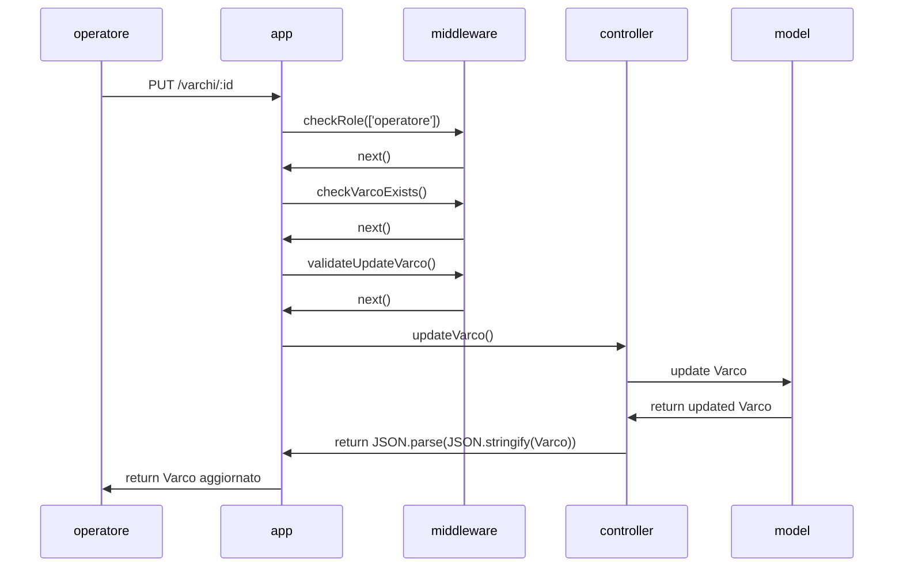
```mermaid
sequenceDiagram
    participant operatore
    participant app
    participant middleware
    participant controller
    participant model

    operatore->>app: PUT /varchi/:id
    app->>middleware: checkRole(['operatore'])
    middleware->>app: next()
    app->>middleware: checkVarcoExists()
    middleware->>app: next()
    app->>middleware: validateUpdateVarco()
    middleware->>app: next()
    app->>controller: updateVarco()
    controller->>model: update Varco
    model->>controller: return updated Varco
    controller->>app: return JSON.parse(JSON.stringify(Varco))
    app->>operatore: return Varco aggiornato
```

#### Output (Successo)
```json
{
    "id": 1,
    "nome": "Varco 1 Updated",
    "ztl_id": 1,
    "orario_apertura": "09:00:00",
    "orario_chiusura": "19:00:00"
}
```

#### Output (Errore)
```json
{
    "status": 400 BAD REQUEST,
    "message": "Orario non valido"
}
```

### DELETE: /varchi/:id

#### Descrizione
Elimina un varco specifico tramite ID.

#### Input
N/A

#### Diagramma di Sequenza
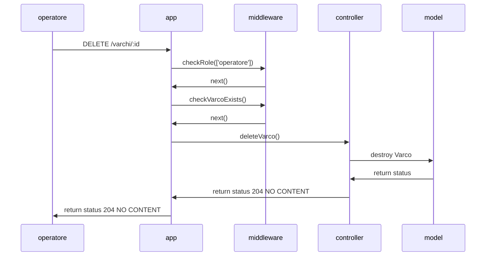
```mermaid
sequenceDiagram
    participant operatore
    participant app
    participant middleware
    participant controller
    participant model

    operatore->>app: DELETE /varchi/:id
    app->>middleware: checkRole(['operatore'])
    middleware->>app: next()
    app->>middleware: checkVarcoExists()
    middleware->>app: next()
    app->>controller: deleteVarco()
    controller->>model: destroy Varco
    model->>controller: return status
    controller->>app: return status 204 NO CONTENT
    app->>operatore: return status 204 NO CONTENT
```

#### Output (Successo)
```json
{
    "status": 204 NO CONTENT,
    "message": "Varco eliminato con successo"
}
```

#### Output (Errore)
```json
{
    "status": 404 NOT FOUND,
    "message": "Varco non trovato"
}
```

### POST: /transiti
#### Descrizione

Questa rotta permette di creare un nuovo transito. Solo gli utenti con ruolo "operatore" o "varco" possono accedervi.

#### Input

```json

{
    "targa_veicolo": "AB123CD",
    "pedaggio": "2023-07-19T08:30:00Z",
    "varco_id": 1,
    "ingresso_uscita": "Ingresso"
}
```

#### Diagramma di Sequenza

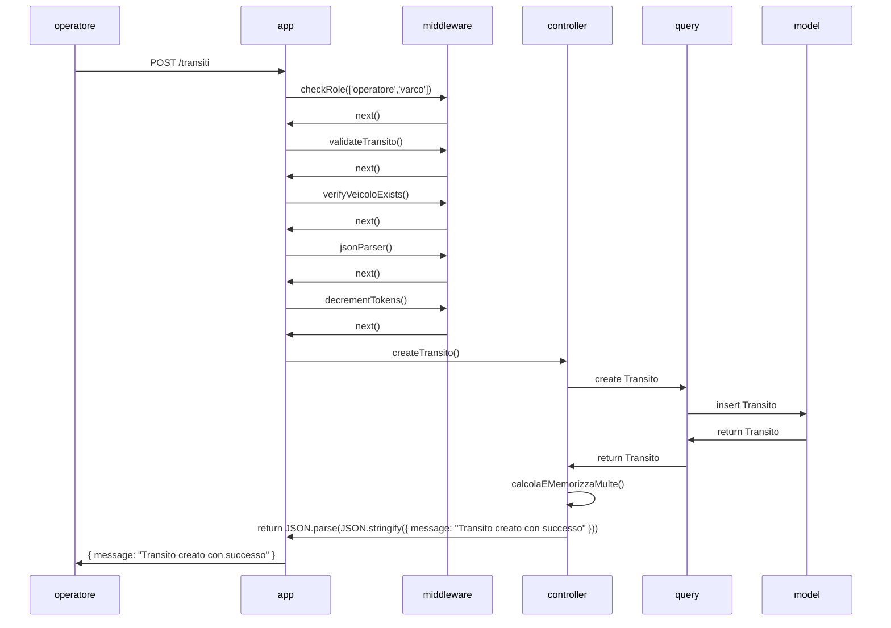
```mermaid

sequenceDiagram
    participant operatore
    participant app
    participant middleware
    participant controller
    participant query
    participant model

    operatore->>app: POST /transiti
    app->>middleware: checkRole(['operatore','varco'])
    middleware->>app: next()
    app->>middleware: validateTransito()
    middleware->>app: next()
    app->>middleware: verifyVeicoloExists()
    middleware->>app: next()
    app->>middleware: jsonParser()
    middleware->>app: next()
    app->>middleware: decrementTokens()
    middleware->>app: next()
    app->>controller: createTransito()
    controller->>query: create Transito
    query->>model: insert Transito
    model->>query: return Transito
    query->>controller: return Transito
    controller->>controller: calcolaEMemorizzaMulte()
    controller->>app: return JSON.parse(JSON.stringify({ message: "Transito creato con successo" }))
    app->>operatore: { message: "Transito creato con successo" }
```

#### Output 

```json

{
    "message": "Transito creato con successo"
}
```

### GET: /transiti
#### Descrizione

Questa rotta permette di ottenere tutti i transiti. Solo gli utenti con ruolo "operatore" possono accedervi.

#### Diagramma di Sequenza

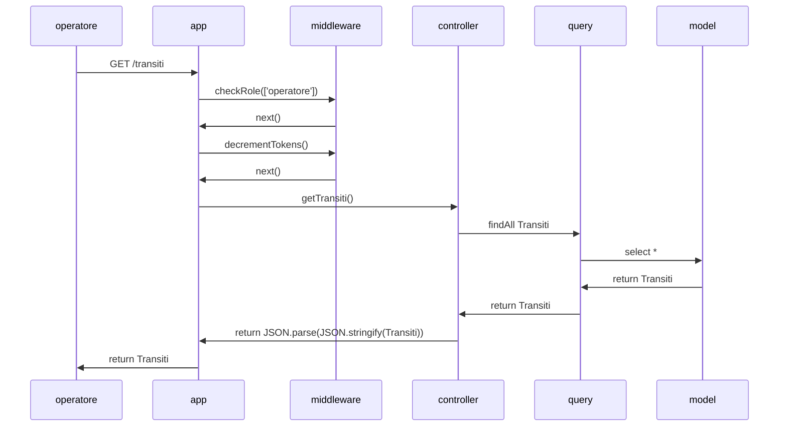
```mermaid

sequenceDiagram
    participant operatore
    participant app
    participant middleware
    participant controller
    participant query
    participant model

    operatore->>app: GET /transiti
    app->>middleware: checkRole(['operatore'])
    middleware->>app: next()
    app->>middleware: decrementTokens()
    middleware->>app: next()
    app->>controller: getTransiti()
    controller->>query: findAll Transiti
    query->>model: select *
    model->>query: return Transiti
    query->>controller: return Transiti
    controller->>app: return JSON.parse(JSON.stringify(Transiti))
    app->>operatore: return Transiti
```

#### Output

```json

[
    {
        "id": 1,
        "targa_veicolo": "AB123CD",
        "pedaggio": "2023-07-19T08:30:00Z",
        "varco_id": 1,
        "ingresso_uscita": "Ingresso"
    },
    ...
]
```

### GET: /transiti/
#### Descrizione

Questa rotta permette di ottenere un transito specifico tramite ID. Solo gli utenti con ruolo "operatore" possono accedervi.

#### Diagramma di Sequenza

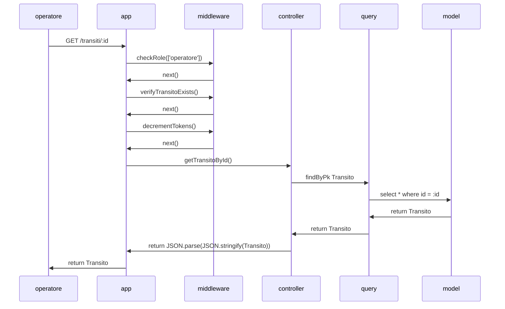
```mermaid

sequenceDiagram
    participant operatore
    participant app
    participant middleware
    participant controller
    participant query
    participant model

    operatore->>app: GET /transiti/:id
    app->>middleware: checkRole(['operatore'])
    middleware->>app: next()
    app->>middleware: verifyTransitoExists()
    middleware->>app: next()
    app->>middleware: decrementTokens()
    middleware->>app: next()
    app->>controller: getTransitoById()
    controller->>query: findByPk Transito
    query->>model: select * where id = :id
    model->>query: return Transito
    query->>controller: return Transito
    controller->>app: return JSON.parse(JSON.stringify(Transito))
    app->>operatore: return Transito
```

#### Output

```json

{
    "id": 1,
    "targa_veicolo": "AB123CD",
    "pedaggio": "2023-07-19T08:30:00Z",
    "varco_id": 1,
    "ingresso_uscita": "Ingresso"
}
```

### PUT: /transiti/
#### Descrizione

Questa rotta permette di aggiornare un transito esistente tramite ID. Solo gli utenti con ruolo "operatore" possono accedervi.

#### Input

```json

{
    "targa_veicolo": "AB123CD",
    "pedaggio": "2023-07-19T09:00:00Z",
    "varco_id": 1,
    "ingresso_uscita": "Uscita"
}
```

#### Diagramma di Sequenza

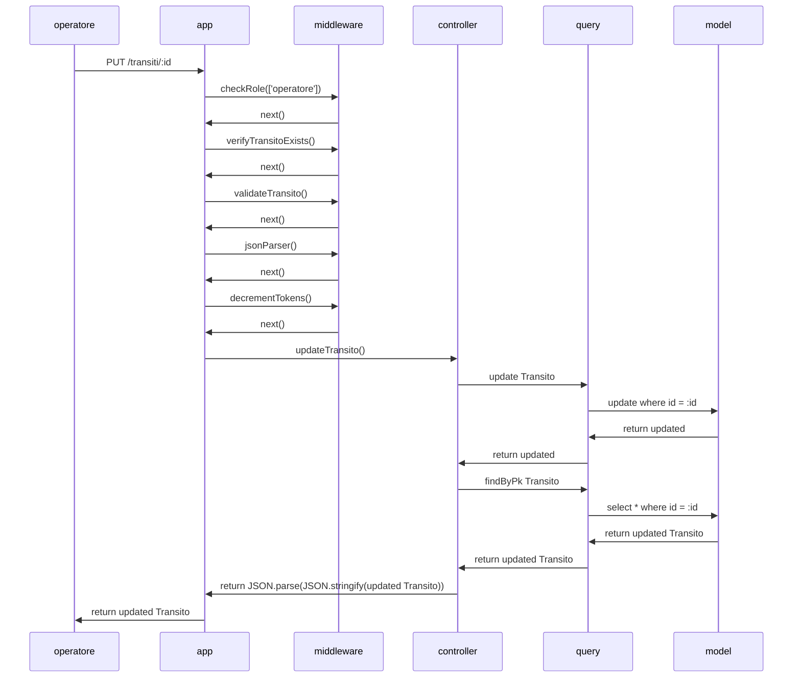
```mermaid

sequenceDiagram
    participant operatore
    participant app
    participant middleware
    participant controller
    participant query
    participant model

    operatore->>app: PUT /transiti/:id
    app->>middleware: checkRole(['operatore'])
    middleware->>app: next()
    app->>middleware: verifyTransitoExists()
    middleware->>app: next()
    app->>middleware: validateTransito()
    middleware->>app: next()
    app->>middleware: jsonParser()
    middleware->>app: next()
    app->>middleware: decrementTokens()
    middleware->>app: next()
    app->>controller: updateTransito()
    controller->>query: update Transito
    query->>model: update where id = :id
    model->>query: return updated
    query->>controller: return updated
    controller->>query: findByPk Transito
    query->>model: select * where id = :id
    model->>query: return updated Transito
    query->>controller: return updated Transito
    controller->>app: return JSON.parse(JSON.stringify(updated Transito))
    app->>operatore: return updated Transito
```

#### Output

```json

{
    "id": 1,
    "targa_veicolo": "AB123CD",
    "pedaggio": "2023-07-19T09:00:00Z",
    "varco_id": 1,
    "ingresso_uscita": "Uscita"
}
```

### DELETE: /transiti/
#### Descrizione

Questa rotta permette di eliminare un transito esistente tramite ID. Solo gli utenti con ruolo "operatore" possono accedervi.

#### Diagramma di Sequenza

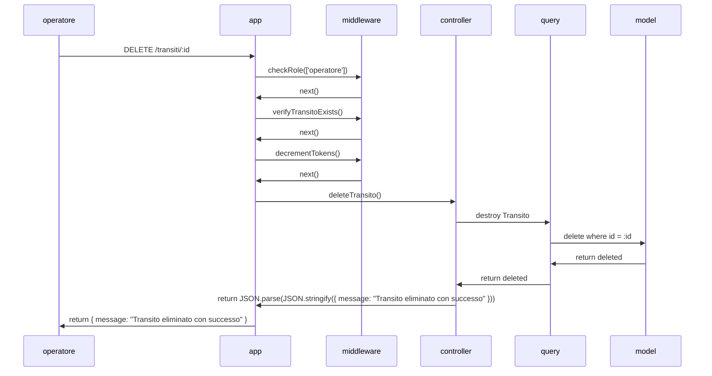
```mermaid

sequenceDiagram
    participant operatore
    participant app
    participant middleware
    participant controller
    participant query
    participant model

    operatore->>app: DELETE /transiti/:id
    app->>middleware: checkRole(['operatore'])
    middleware->>app: next()
    app->>middleware: verifyTransitoExists()
    middleware->>app: next()
    app->>middleware: decrementTokens()
    middleware->>app: next()
    app->>controller: deleteTransito()
    controller->>query: destroy Transito
    query->>model: delete where id = :id
    model->>query: return deleted
    query->>controller: return deleted
    controller->>app: return JSON.parse(JSON.stringify({ message: "Transito eliminato con successo" }))
    app->>operatore: return { message: "Transito eliminato con successo" }
```

#### Output

```json

{
    "message": "Transito eliminato con successo"
}
```

### GET: /transitistato
#### Descrizione

Questa rotta permette di ottenere i transiti filtrati per stato, targhe e date. Accessibile agli utenti con ruolo "operatore" e "automobilista".

#### Input (Query Parameters)

targhe: Array di targhe dei veicoli.
startDate: Data di inizio del periodo.
endDate: Data di fine del periodo.
format: Formato di output (json o pdf).

#### Diagramma di Sequenza

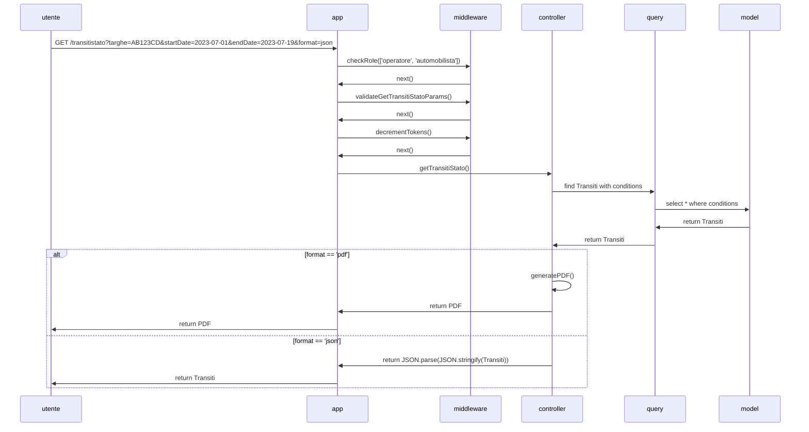
```mermaid

sequenceDiagram
    participant utente
    participant app
    participant middleware
    participant controller
    participant query
    participant model

    utente->>app: GET /transitistato?targhe=AB123CD&startDate=2023-07-01&endDate=2023-07-19&format=json
    app->>middleware: checkRole(['operatore', 'automobilista'])
    middleware->>app: next()
    app->>middleware: validateGetTransitiStatoParams()
    middleware->>app: next()
    app->>middleware: decrementTokens()
    middleware->>app: next()
    app->>controller: getTransitiStato()
    controller->>query: find Transiti with conditions
    query->>model: select * where conditions
    model->>query: return Transiti
    query->>controller: return Transiti
    alt format == 'pdf'
        controller->>controller: generatePDF()
        controller->>app: return PDF
        app->>utente: return PDF
    else format == 'json'
        controller->>app: return JSON.parse(JSON.stringify(Transiti))
        app->>utente: return Transiti
    end
```

#### Output (JSON)

```json

[
    {
        "id": 1,
        "targa_veicolo": "AB123CD",
        "pedaggio": "2023-07-19T08:30:00Z",
        "varco_id": 1,
        "ingresso_uscita": "Ingresso"
    },
    ...
]
```


### GET: /multe/:id/download
Questa rotta consente agli operatori e ai varchi di scaricare il PDF di una multa specifica.

#### Corpo della Richiesta

Non è necessario un corpo per questa richiesta. I dati vengono passati tramite il parametro dell'URL :id.

#### Diagramma di Sequenza

```mermaid

sequenceDiagram
    participant client
    participant app
    participant middleware
    participant controller
    participant query
    participant model

    client->>app: GET /multe/:id/download
    app->>middleware: checkRole(['operatore', 'varco'])
    middleware->>app: next()
    app->>middleware: decrementTokens()
    middleware->>app: next()
    app->>controller: downloadMultaPDF()
    controller->>query: findByPk(id)
    query->>model: findByPk(id)
    model->>query: return: Multa
    query->>controller: return: Multa
    controller->>controller: generateMultaPDF(multa)
    controller->>controller: update({ is_pagata: true })
    controller->>app: return: PDF Buffer
    app->>client: return: PDF File
```

#### Output (Successo)

Se la richiesta viene effettuata correttamente, il server restituisce un file PDF.

less

Header:
    Content-Type: application/pdf
    Content-Disposition: attachment; filename=bollettino.pdf

Body:
    [Binary PDF Data]

#### Output (Errore)

Multa non trovata

```json

{
    "status": 404,
    "message": "Multa non trovata"
}
```

Errore nella generazione del PDF

```json

{
    "status": 500,
    "message": "Errore nella generazione del PDF"
}
```

### GET: /multeautomobilista
Questa rotta permette agli automobilisti di ottenere tutte le multe associate ai loro veicoli.

#### Corpo della Richiesta

Non è necessario un corpo per questa richiesta. L'autenticazione avviene tramite il token JWT nell'header di autorizzazione.

#### Diagramma di Sequenza

```mermaid

sequenceDiagram
    participant client
    participant app
    participant middleware
    participant controller
    participant query
    participant model

    client->>app: GET /multeautomobilista
    app->>middleware: checkRole(['automobilista'])
    middleware->>app: next()
    app->>middleware: decrementTokens()
    middleware->>app: next()
    app->>controller: getMultePerAutomobilista()
    controller->>controller: decodeJwt(token)
    controller->>query: getUserByEmail(email)
    query->>model: findUserByEmail(email)
    model->>query: return: User
    query->>controller: return: User
    controller->>query: findAllVeicoliByUserId(user.id)
    query->>model: findAllVeicoli(user.id)
    model->>query: return: Veicoli
    query->>controller: return: Veicoli
    controller->>query: findAllMulteByTarghe(targhe)
    query->>model: findAllMulte(targhe)
    model->>query: return: Multe
    query->>controller: return: Multe
    controller->>app: return: Multe
    app->>client: return: JSON Array of Multe
```

#### Output (Successo)

Se la richiesta viene effettuata correttamente, il server restituisce un array di multe.

```json

[
    {
        "id": 1,
        "targa_veicolo": "AA123BB",
        "importo": 100,
        "is_pagata": false,
        "data_infrazione": "2023-07-19T00:00:00.000Z"
    },
    ...
]
```

#### Output (Errore)
Utente non autorizzato

```json

{
    "status": 401,
    "message": "Utente non autorizzato"
}
```

Utente non trovato
```json

{
    "status": 404,
    "message": "Utente non trovato"
}
```

Nessun veicolo associato trovato
```json

{
    "status": 404,
    "message": "Nessun veicolo associato trovato"
}
```

Errore interno del server
```json

{
    "status": 500,
    "message": "Errore interno del server"
}
```


### GET: /statistiche
Questa rotta permette di ottenere le statistiche associate ad un varco.
#### Corpo della Richiesta
Per poter ottenere una risposta, la richiesta dovrà includere i seguenti parametri nella query:

varco_id: (numero) L'ID del varco per cui si vogliono ottenere le statistiche.
start_date: (stringa) La data di inizio del periodo per cui si vogliono ottenere le statistiche (formato YYYY-MM-DD).
end_date: (stringa) La data di fine del periodo per cui si vogliono ottenere le statistiche (formato YYYY-MM-DD).
format: (stringa, opzionale) Il formato in cui si vogliono ottenere le statistiche (json o pdf).
Il meccanismo che si innesca all'atto della chiamata è descritto dal seguente diagramma:

#### Diagramma di Sequenza

```mermaid

sequenceDiagram
    participant operatore
    participant app
    participant middleware
    participant controller
    participant database

    operatore->>app: GET /statistiche?varco_id=1&start_date=2023-01-01&end_date=2023-01-31&format=json
    app->>middleware: checkRole(['operatore'])
    middleware->>app: next()
    app->>middleware: validateStatisticheParams()
    middleware->>app: next()
    app->>middleware: decrementTokens()
    middleware->>app: next()
    app->>controller: getStatistiche()
    controller->>database: Query transiti (varco_id, start_date, end_date)
    database-->>controller: Risultati transiti
    controller->>database: Query multe (transito_ids)
    database-->>controller: Risultati multe
    controller->>controller: Calcolo statistiche
    alt Formato JSON
        controller->>operatore: JSON con statistiche
    else Formato PDF
        controller->>operatore: PDF con statistiche
    end
```
#### Output (Successo)
Se la richiesta viene effettuata correttamente, verranno restituiti i seguenti dati:

Formato JSON

```json

{
    "varco_id": 1,
    "transitiTotali": 150,
    "violazioniTotali": 25,
    "importoTotaleMulte": 5000,
    "rapportoViolazioniTransiti": 0.1667
}
```

Formato PDF

Il PDF conterrà le seguenti informazioni:

ID del varco
Numero totale di transiti
Numero totale di violazioni
Importo totale delle multe
Rapporto violazioni/transiti
In caso di errore verrà restituito un messaggio che ha come chiave il nome del codice violato e un messaggio di errore a seconda della casistica. Inoltre, verrà settato lo stato a seconda dello status code:

#### Output (Errore)
Esempio di errore

Se varco_id non è valido:

```json

{
    "status": 400,
    "message": "L'id del varco è nullo o invalido"
}
```

Se start_date non è valida:

```json

{
    "status": 400,
    "message": "La data d'inizio non è valida"
}
```

Se end_date non è valida:

```json

{
    "status": 400,
    "message": "La data di fine non è valida"
}
```

Se end_date è precedente a start_date:

```json

{
    "status": 400,
    "message": "La data di fine deve essere successiva alla data di inizio."
}
```

Se format non è json o pdf:

```json

{
    "status": 400,
    "message": "Il formato deve essere o json o pdf"
}
```

Se si verifica un errore interno del server:

```json

{
    "status": 500,
    "message": "Errore nel calcolo delle statistiche"
}
```

Output (PDF)

Il PDF generato contiene i dettagli dei transiti in formato tabellare.


## Testing

Per testare il progetto, è essenziale seguire una serie di passaggi che garantiscano la configurazione corretta dell'ambiente di sviluppo e l'esecuzione efficace dei test. Ecco una guida dettagliata:

1. Scaricare il Progetto

Clonare il repository Git utilizzando l'URL fornito o scaricare direttamente il file ZIP.

2. Importare il Pacchetto Postman

Nella cartella Postman del progetto, troverai un pacchetto di chiamate da importare in Postman per testare le API.
Apri Postman, vai su "File" -> "Import" e seleziona il pacchetto .json allegato insieme al progetto

3. Installare Docker

Scarica e installa Docker dal sito ufficiale per gestire i container necessari al progetto.
Assicurati che Docker sia in esecuzione.

5. Avviare i Servizi con Docker

Spostati nella cartella backend del progetto:

```bash

cd ztl_project
```

Avvia i servizi necessari con Docker utilizzando il comando:

```bash

docker-compose up --build
Questo comando costruirà e avvierà i container definiti nel file docker-compose.yml.
```

6. Verifica del Funzionamento

Una volta che i container sono avviati correttamente, verifica che l'applicazione sia in esecuzione.
Utilizza le chiamate API importate in Postman per testare le funzionalità dell'applicazione.
Seguendo questi passaggi, dovresti essere in grado di configurare correttamente l'ambiente di sviluppo e testare le API del progetto. Se riscontri problemi, consulta la documentazione del progetto o cerca aiuto nei forum di supporto.


## Autori

- Jacopo Tarulli
- Luca Procaccini

